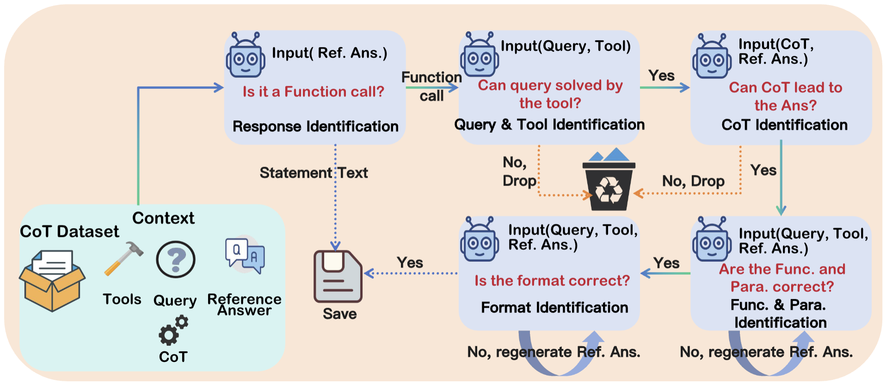
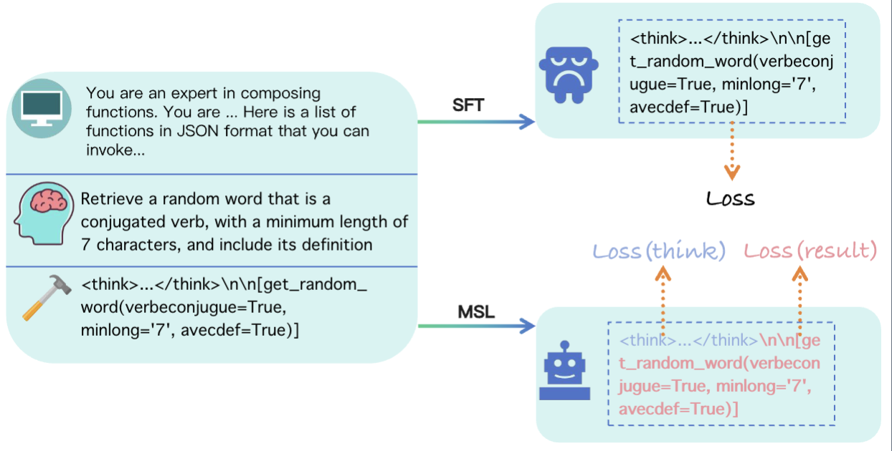
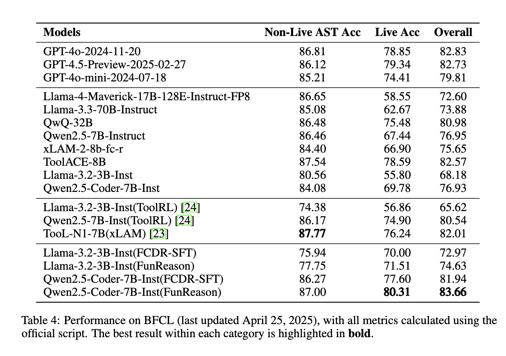
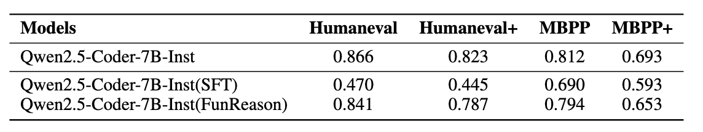

# FunReason: Enhancing Large Language Models' Function Calling via Self-Refinement Multiscale Loss and Automated Data Refinement

<p align="center">
         &nbsp&nbsp📊 <a href="https://huggingface.co/Bingguang/FunReason">Dataset(Coming)</a>&nbsp&nbsp | &nbsp&nbsp🤗 <a href="https://huggingface.co/Bingguang/FunReason">Hugging Face</a>&nbsp&nbsp | &nbsp&nbsp 📑 <a href="https://huggingface.co/Bingguang/FunReason">Paper(Coming)</a> &nbsp&nbsp | &nbsp&nbsp 📑 <a href="https://huggingface.co/Bingguang/FunReason">Blog(Coming)</a> &nbsp&nbsp ｜ &nbsp&nbsp📖 <a href="https://github.com/BingguangHao/FunReason">Github</a>
</p>

> [!IMPORTANT]
> - **We will release all the code, training dataset and model weight, waiting the confidential review of Ant Group.**
> 
> - **Please give a ⭐️ to follow the update which is also an incentive for us.**


## Abstract

> The integration of large language models (LLMs) with function calling has emerged as a crucial capability for enhancing their practical utility in real-world applications. However, effectively combining reasoning processes with accurate function execution remains a significant challenge. Traditional training approaches often struggle to balance the detailed reasoning steps with the precision of function calls, leading to suboptimal performance. To address these limitations, we introduce FunReason, a novel framework that enhances LLMs' function calling capabilities through an automated data refinement strategy and a Self-Refinement Multiscale Loss (SRML) approach. FunReason leverages LLMs' natural reasoning abilities to generate high-quality training examples, focusing on query parseability, reasoning coherence, and function call precision. The SRML approach dynamically balances the contribution of reasoning processes and function call accuracy during training, addressing the inherent trade-off between these two critical aspects. FunReason achieves performance comparable to GPT-4o while effectively mitigating catastrophic forgetting during fine-tuning. FunReason provides a comprehensive solution for enhancing LLMs' function calling capabilities by introducing a balanced training methodology and a data refinement pipeline. For code and dataset, please refer to our repository at GitHub.
>

## FunReason

<p align="center">

</p>

**Overview of FunReason's data refinement pipeline.** The pipeline consists of five stages: Function Call Classification, Query and Tool Identification, CoT Identification, Function and Parameter Identification, and Format Identification. Each stage ensures specific aspects of data quality, with failing examples either being discarded or regenerated.

**We will release all the data that refined in this process, whcih contains 60k high quality CoT data for function call.**


<p align="center">

</p>

**Self-Refinement Multiscale Loss.** Traditional loss functions often overemphasize the lengthy reasoning process at the expense of function call accuracy. The inherent trade-off between reasoning quality and function call correctness, leading to the development of our balanced approach.

<p align="center">

</p>

**Self Refinement Strategy.** Following the MSL training, we employ a Self-Refinement strategy to further enhance the model capabilities. In this phase, the MSL-trained model samples from the original xLAM dataset, generating its own Chain-of-Thought reasoning and corresponding function calls. Subsequently, this self-generated data is fed into the data refinement pipeline for automated inspection and improvement. Only the refined data, having passed the rigorous quality checks of the data refinement, is then used to further update the model's parameters. This iterative process allows the model to learn from its own improved outputs, leading to continuous self-enhancement of its function calling and reasoning abilities.

## Main Result
<p align="center">

</p>


<p align="center">

</p>


## Citation
```md
@article{FunReason,
  title={FunReason: Enhancing Large Language Models' Function Calling via Self-Refinement Multiscale Loss and Automated Data Refinement},
  author={Bingguang Hao, Maolin Wang, Zengzhuang Xu, Cunyin Peng, Yicheng Chen, Xiangyu Zhao, Jinjie Gu, Chenyi Zhuang}
}
```
