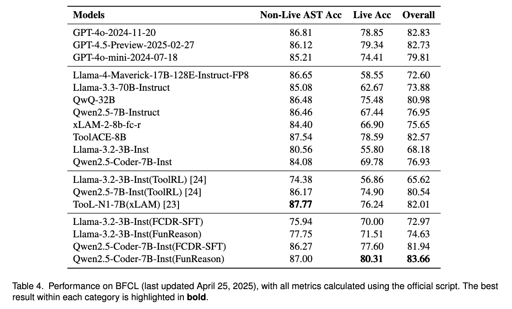
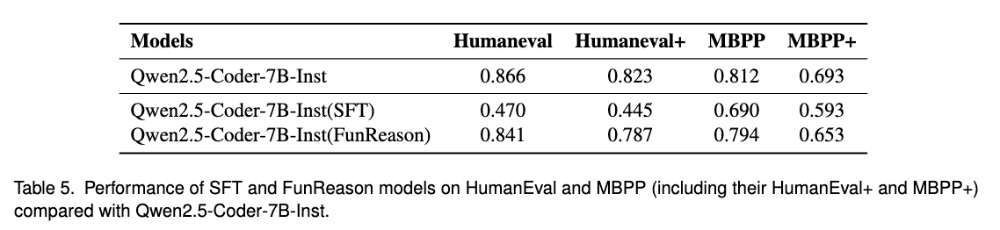

# Think, Scale, Execute: A Multiscale Loss Approach for Enhanced LLM Function Calling

This is the official repository of the project FunReason, repository for paper "Think, Scale, Execute:A Multiscale Loss Approach for Enhanced LLM Function Calling"

> [!IMPORTANT]
> - **We will release all the code and training dataset in this repository, waiting the confidential review of Ant Group.**
> 
> - **Please give a ⭐️ to follow the update which is also an incentive for us.**


## Abstract

> While Large Language Models (LLMs) have demonstrated remarkable capabilities across various domains, they still face significant challenges in function calling scenarios. While existing Reinforcement Learning (RL) and Supervised Fine-tuning (SFT) methods often sacrifice reasoning depth for conciseness or vice versa, this critical trade-off limits model performance in complex tasks. This paper introduces a novel multiscale loss approach that effectively balances reasoning processes (Chain-of-Thought, CoT) with concise outputs during training. Furthermore, we design a comprehensive data refinement strategy to generate a 60k CoT function calling dataset, ensuring query parseability, CoT accuracy, and tool parameter correctness through careful checking. Experimental results demonstrate that, when trained with our proposed multiscale loss and this generated CoT dataset, a 7B model can achieve performance comparable to GPT-4 in function calling tasks. In the HumanEval and MBPP benchmarks, our approach significantly mitigates catastrophic forgetting during the fine-tuning process. 
>

## FunReason

<p align="center">

</p>

**Overview of FunReason's data refinement pipeline.** The pipeline consists of five stages: Function Call Classification, Query $\&$ Tool Identification, CoT Identification, Function $\&$ Parameter Identification, and Format Identification. Each stage ensures specific aspects of data quality, with failing examples either being discarded or regenerated.

**We will release all the data that refined in this process, whcih contains 60k high quality CoT data for function call.**


<p align="center">

</p>

**Self-Refinement Multiscale Loss.** Traditional loss functions often overemphasize the lengthy reasoning process at the expense of function call accuracy. The inherent trade-off between reasoning quality and function call correctness, leading to the development of our balanced approach.

**Self Refinement Strategy.** Following the MSL training, we employ a Self-Refinement strategy to further enhance the model capabilities. In this phase, the MSL-trained model samples from the original xLAM dataset, generating its own Chain-of-Thought reasoning and corresponding function calls. Subsequently, this self-generated data is fed into the data refinement pipeline for automated inspection and improvement. Only the refined data, having passed the rigorous quality checks of the data refinement, is then used to further update the model's parameters. This iterative process allows the model to learn from its own improved outputs, leading to continuous self-enhancement of its function calling and reasoning abilities.

## Main Result
<p align="center">

</p>

Performance on BFCL (last updated April 25, 2025), with all metrics calculated using the official script. The best result within each category is highlighted in bold.


<p align="center">

</p>

Performance of SFT and FunReason models on HumanEval and MBPP (including their HumanEval+ and MBPP+) compared with Qwen2.5-Coder-7B-Inst.


## Citation
```md
@article{FunReason,
  title={Think, Scale, Execute: A Multiscale Loss Approach for Enhanced LLM Function Calling},
  author={Bingguang Hao, Maolin Wang, Zengzhuang Xu, Cunyin Peng, Yicheng Chen, Xiangyu Zhao, Jinjie Gu, Chenyi Zhuang}
}
```
